# longan_nano_rust_wsl2_platformio_setup

*Luciano Bestia 2021-08-08*  

How to setup a development environment for rust in Win10 + WSL2 + VSCode for Longan nano GD32 Risc-V development board  

## Sipeed Longan nano

I just received my 2 [Sipeed Longan nano](http://longan.sipeed.com/en/) development boards ordered on [AliExpress](https://www.aliexpress.com/item/4000505297604.html?spm=a2g0s.9042311.0.0.6b4b4c4dYrInFR). They are cute and cheap. One has even a tiny lcd display.  
The Risc-V chip on the board is GD32VF103CBT6 or in short [GD32V](https://www.gigadevice.com/products/microcontrollers/gd32/) from GigaDevice.
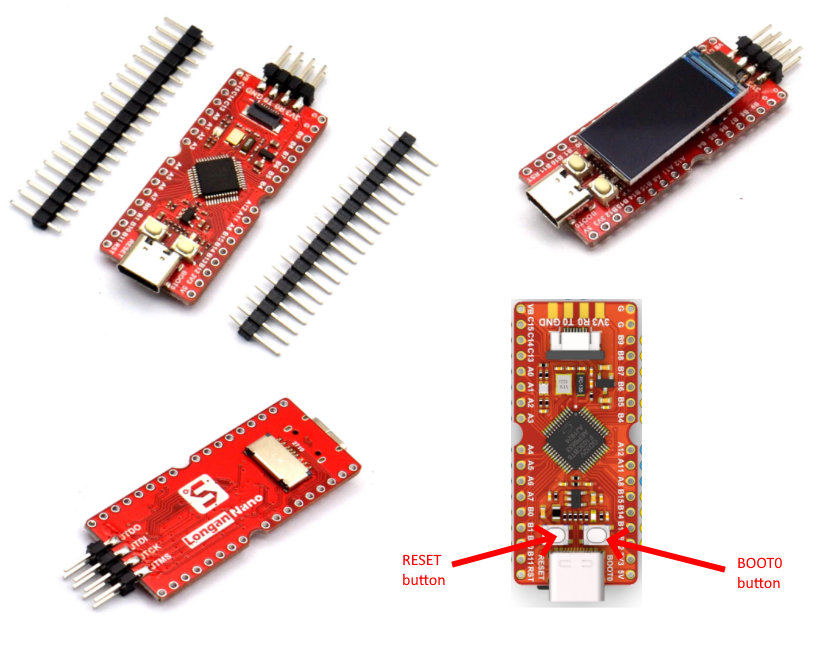  
I always wanted to play with a [Risc-V](https://riscv.org/about/) micro-processor. I think they are the future. I believe they will grow and will be used in phones, laptops and servers, not only in microcontrollers. But I hope designers will find a way to avoid [malware](https://en.wikipedia.org/wiki/Malware) inside the silicon. That would be a ruined future.  

## Rust on WSL

Usually the microcontroller is programmed in C, but I am a fan of the [rust](https://www.rust-lang.org/) programming language and want to try it with Longan Nano.  
I use [VSCode](https://code.visualstudio.com/) in [Win10](https://www.microsoft.com/sl-si/software-download/windows10), but all [rust](https://www.rust-lang.org/) coding and building happens inside [WSL2](https://www.sitepoint.com/wsl2/) in [Debian Linux](https://www.debian.org/).  
This combination works very well for building [CLI](https://en.wikipedia.org/wiki/Command-line_interface) and [Wasm](https://en.wikipedia.org/wiki/WebAssembly) applications in Rust.  
VSCode has a plugin [Remote - WSL extension](https://marketplace.visualstudio.com/items?itemName=ms-vscode-remote.remote-wsl) that installs a "vscode server" in Debian. Then the VSCode Win10 [GUI](https://en.wikipedia.org/wiki/Graphical_user_interface) frontend talks to the "remote" Debian WSL2 backend for all files and operations. All the files and development tools are in Debian. Only the GUI is in Windows.  

Short instructions:  
Install [WSL2](https://docs.microsoft.com/en-us/windows/wsl/install-win10) and inside it the [Debian Linux distro](https://www.debian.org/).  
In Debian we need rust (rust programming language). Use [rustup](https://www.rust-lang.org/learn/get-started) to install it, find it on their [official page](https://www.rust-lang.org/).  Something like this:  
`$ curl --proto '=https' --tlsv1.2 -sSf https://sh.rustup.rs | sh`  

Install [VSCode](https://code.visualstudio.com/) in Win10.  
Then in VSCode install the [Remote - WSL extension](https://marketplace.visualstudio.com/items?itemName=ms-vscode-remote.remote-wsl).  
I like to have this "local plugin" (in Win10) for VSCode:  

- [vscode-icons](https://marketplace.visualstudio.com/items?itemName=vscode-icons-team.vscode-icons)

and these "WSL-Debian plugins":  

- [rust-analyzer](https://marketplace.visualstudio.com/items?itemName=matklad.rust-analyzer)
- [Code Spell Checker](https://marketplace.visualstudio.com/items?itemName=streetsidesoftware.code-spell-checker)
- [crates](https://marketplace.visualstudio.com/items?itemName=serayuzgur.crates)
- [markdownlint](https://marketplace.visualstudio.com/items?itemName=DavidAnson.vscode-markdownlint)
- [Rainbow Brackets](https://marketplace.visualstudio.com/items?itemName=2gua.rainbow-brackets)

## PlatformIO (PIO)

[PlatformIO](https://marketplace.visualstudio.com/items?itemName=platformio.platformio-ide) is a plugin/extension for VSCode. It allows to build and download programs to the development board right inside VSCode. Install this extension in WSL-Debian.  
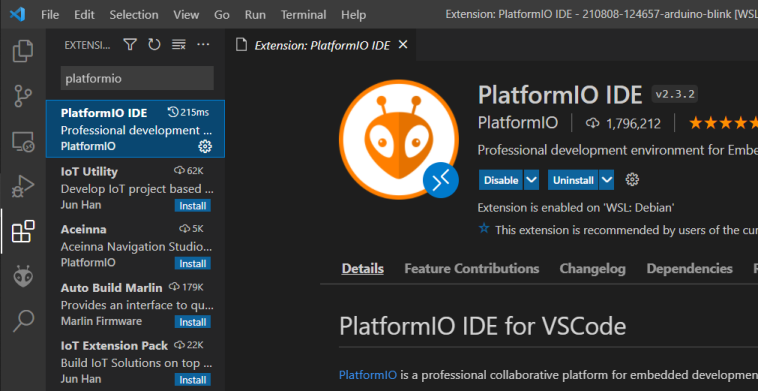  
Then install the platform gd32v for you Longan Nano board. Click on the extension icon (the alien face), then click on New Terminal and then type:  
`platformio platform install gd32v`  
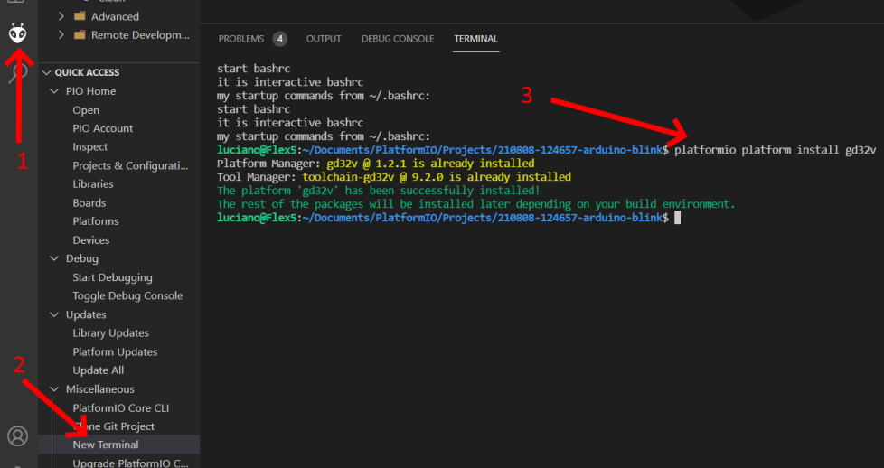  

## DFU (Device Firmware Upgrade) driver

The Nano can be simply connected with a usb-C cable to the computer for power and data communication.  
Sadly we cannot use WSL2 for USB special communication. All the USB are attached natively to Win10 and we must use it exclusively on Win10. But I have a workaround ;-)  
Connect your Nano to the computer with a usb-c cable.  
Now the USB is used only for power. This is the "normal mode". Windows does not recognize any USB device.  
If you press and hold the `BOOT0` (right) button and then press shortly the `RESET` (left) button and then release the `BOOT0` button, you will put the Longan Nano in "[DFU mode](http://wiki.openmoko.org/wiki/USB_DFU_-_The_USB_Device_Firmware_Upgrade_standard
)". Now the Longan nano is communicating with the computer over usb. This special mode is used to upgrade the firmware and it is a official USB standard. You will need to do this every time you want to upgrade the firmware and that is super often in development. Get comfortable with these super tiny buttons ;-)  

In the moment Longan Nano enters the "DFU mode" Win10 will recognize a new USB device and usually make a sound. Open the Device Manager: click on Start and type *manage*, this will show the Device Manager in the results and then click on it. Or just type `devmgmt.msc` in the command prompt or PowerShell.  
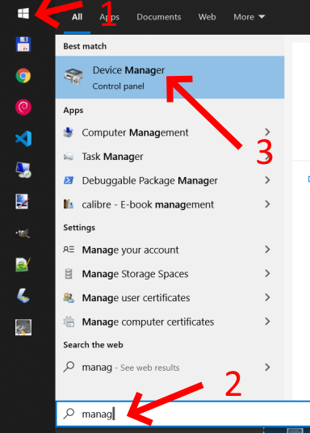  
If the Device Manager is already opened, in the moment you activate the "dfu mode" on the board, Device Manager will refresh to show the new usb device. Leave the Device manager open, we will need it a lot the first time to setup the thing.  
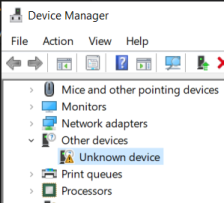  
We can see a new "Unknown device" when the Nano is in "DFU mode". That is not good enough. We need a driver.  
First we will install the original driver from Sipeed. Open the page  
<http://dl.sipeed.com/LONGAN/Nano/Tools>  
and click on `GD32_MCU_Dfu_Tool_V3.8.1.5784_1.rar` to download the 10MB drivers. Don't miss the captcha or `you are a robot` ;-)  
Unzip the folders：GD32 MCU Dfu Drivers_v1.0.1.2316  
Right click on `GD32 MCU Dfu Drivers_v1.0.1.2316\x64\GD32 MCU Dfu Drivers.exe` and run as administrator.  
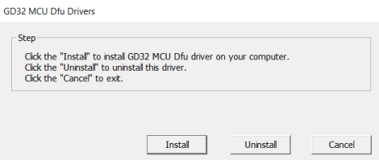  
Click on Install and after successful installation click Cancel to close the window. Strange choice of words "Cancel", it should be "Close". Also in their [online instructions](https://longan.sipeed.com/en/) is really visible that the main effort was in Chinese and not in the English language. Some translations are pretty bad.  
Now in Device Manager at the bottom in the section "Universal Serial Bus controllers" we see the new driver.  
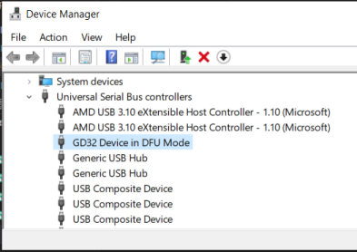  
This would be enough if we wanted to use the application from Sipeed: `GD32 MCU Dfu Tool_v3.8.1.5784\GD32 MCU Dfu Tool.exe`. But we don't want to do that. It is a windows GUI application, and we want to use a CLI application that can be a part of our workflow for building and downloading to the Longan Nano.  
`Interesting:` the word "download" is used to send the firmware from the computer to the board and the word "upload" is used to send the firmware from the board to the computer. For me it sounds confusing, but this is the professional lingo!  

## dfu-util and Zadig

We want to use the CLI application [dfu-utils](http://dfu-util.sourceforge.net/).  
There are a few problems there and we need to find some workarounds, so bear with me and be extra attentive.  

The best use of `dfu-util` is from `Linux`, but as I said earlier we have no luck, because `WSL2` does not use native USB.  
There exists also the release `dfu-util for Windows 0.9`, but it has a bug and does not work with the GD32 driver.  
I have you covered. Here is the workaround:  

We need a special type of driver called [WinUSB](https://en.wikipedia.org/wiki/WinUSB). We will use the application [Zadig](https://zadig.akeo.ie/) to replace our GD32 driver with the WinUSB driver. Open the page <https://zadig.akeo.ie/> and click on `Zadig 2.5 (4.9 MB)` to download it.  
Put your Longan Nona in "dfu mode". You know: BOOT0 and RESET buttons.  
Double click on `zadig-2.5.exe` to run it. You will be asked `Do you want to allow this app to make changes to your device?` and choose Yes. It is a driver, it must change something.  
From the menu choose Options - List All Devices.  
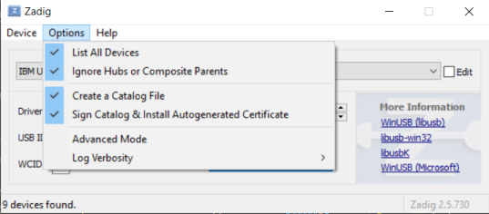  
When you open the DropDown there is bunch of existing usb drivers.  
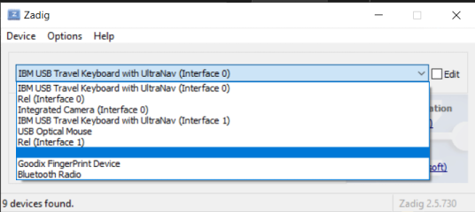  
Interestingly, there is one driver without a name. I don't know why, but this is our GD32 driver. Click on it.  
I want to give this driver a name. Click on the checkbox Edit,  
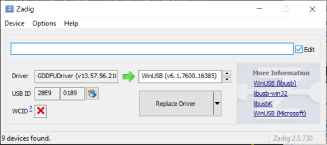  
write the driver name "WinUSB Longan Nano"  
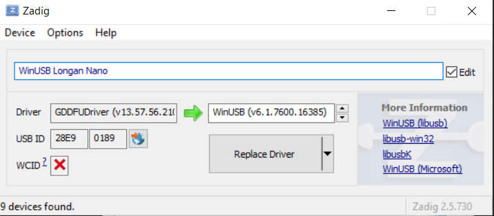  
and click again on the Edit checkbox.  
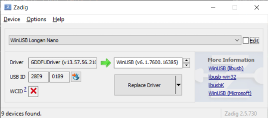  
Now the driver has a name. I hope.  
And now the magic part. Click on `Replace Driver`.  
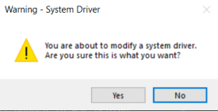  
Say Yes.  
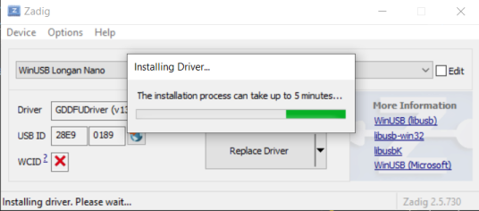  
Be patient.  
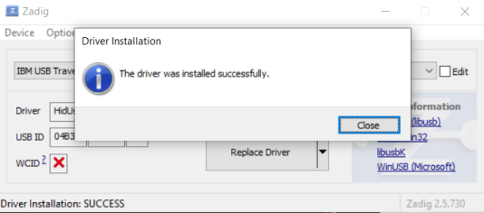  
Done! Close it.  

Open Device Manager and put the Nano in "dfu mode" again. The new situation has a new "Universal Serial Bus devices", but sadly it is called Unknown device.  
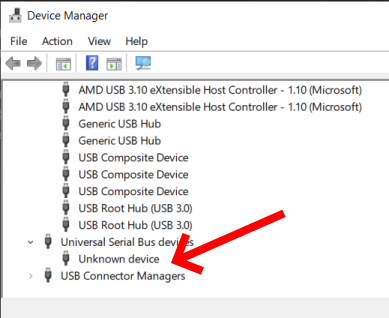  
Double click on it and choose the tab Details and you will see that it is really our new driver "WinUSB Longan Nano".  
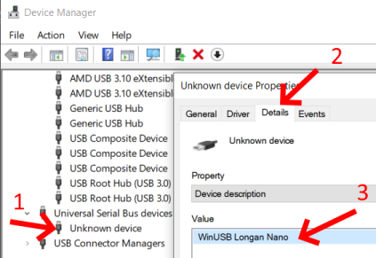  

The dfu-util for Windows you can download on the internet is version 0.9. Sadly it has a bug and it does not work for GD32V. But I have a workaround. The people from PlatformIO have built the version 0.10 for Windows, but it is not available on the internet to download. But we get it when we install PlatformIO on VSCode on Windows. I did that. I found the `tool-dfuutil\bin` folder in `c:\Users\Luciano\.platformio\packages\tool-dfuutil\bin`.  
Here you can download the bin folder:  
<https://github.com/LucianoBestia/longan_nano_rust_wsl2_platformio_setup/raw/main/tool-dfuutil/bin.zip>

Now we can empty the `tool-dfuutil/bin` folder on WSL2, because it will never work in Linux in WSL2.  
If you use a windows tool (I use Total Commander) the path is:  
`\\wsl$\Debian\home\luciano\.platformio\packages\tool-dfuutil\bin`.  
If you use a Linux tool the path is: `~/.platformio/packages/tool-dfuutil/bin`.  

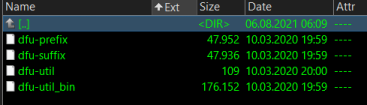  
Just delete all 4 files. We will not need them, never.  

Now copy the content of the zip file to that folder. It sounds strange to have Windows exe files inside a linux folder, but trust me. It will work on WSL2 because of a magic collaboration between Windows and WSL2.  
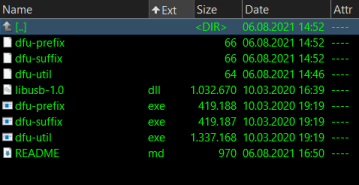  
The Linux PlatformIO cannot directly call the windows exe files because they have the extension `.exe`.  
But we can create [symlinks](https://en.wikipedia.org/wiki/Symbolic_link), so it will look to PlatformIO as nothing has changed. Run this in Linux bash:  

```bash
ln -s ~/.platformio/packages/tool-dfuutil/bin/dfu-util.exe ~/.platformio/packages/tool-dfuutil/bin/dfu-util
ln -s ~/.platformio/packages/tool-dfuutil/bin/dfu-suffix.exe ~/.platformio/packages/tool-dfuutil/bin/dfu-suffix
ln -s ~/.platformio/packages/tool-dfuutil/bin/dfu-prefix.exe ~/.platformio/packages/tool-dfuutil/bin/dfu-prefix
```  

make it executable

```bash
chmod +x ~/.platformio/packages/tool-dfuutil/bin/dfu-util
chmod +x ~/.platformio/packages/tool-dfuutil/bin/dfu-suffix
chmod +x ~/.platformio/packages/tool-dfuutil/bin/dfu-prefix
```

Et voilà ! There we are !  

## Original Blinky example in C

Let's try our environment now.  
Open VSCode. Normally it opens in Windows Mode. You can tell by the green box in the left bottom corner. This is how it looks for Windows mode:  
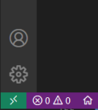  
and this is how it looks in WSL-Debian mode:  
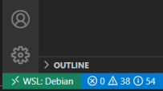  
If you click on this green box it opens some new commands:  
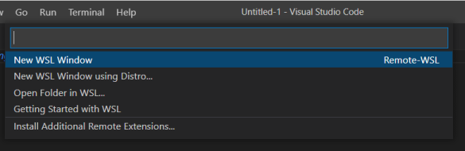  
Click on `New WSL Window` and now your VSCode is in WSL-Debian mode.  
Click on the icon for PlatformIO and then Open and then `Project Examples`.  
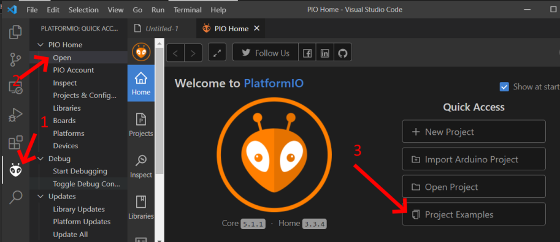  
Select an example  
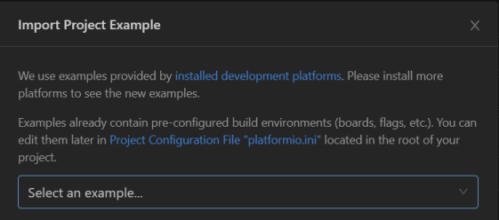  
Choose Arduino blink  
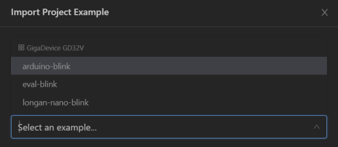  
Click Import  
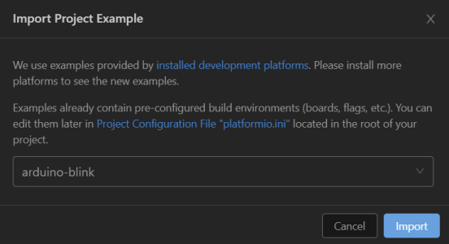  
The folder of the imported projects shows:  
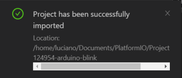  
Now we can open this project folder:  
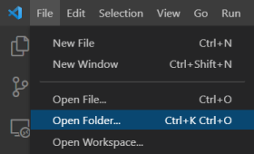  
Observe that we are working in the Linux file system :  
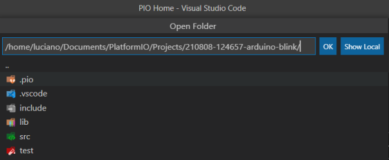  
If it asks you to trust the author, answer Yes.  
This is our project now:  
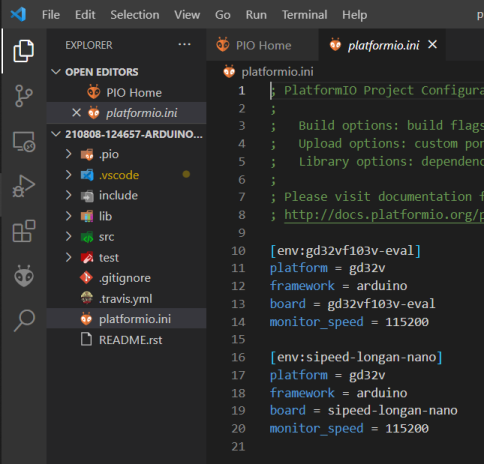  
We have to make some changes to the `platformio.ini` to look like this:  

```ini
; https://docs.platformio.org/page/projectconf.html

[env:sipeed-longan-nano]
platform = gd32v
framework = arduino
board = sipeed-longan-nano
monitor_speed = 115200
upload_protocol = dfu
```

Time to build! On the bottom status bar find and click on this (PlatformIO: Build):  
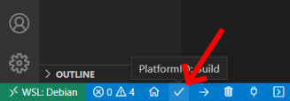  
Build successful:  
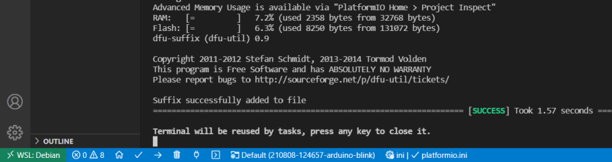  
Time to download our app to the board. Put your Nano in "dfu mode" (remember BOOT0 and RESET buttons). In the bottom status bar find and click on this (PlatformIO: Upload):  
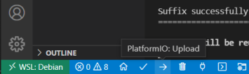  
Download successful:  
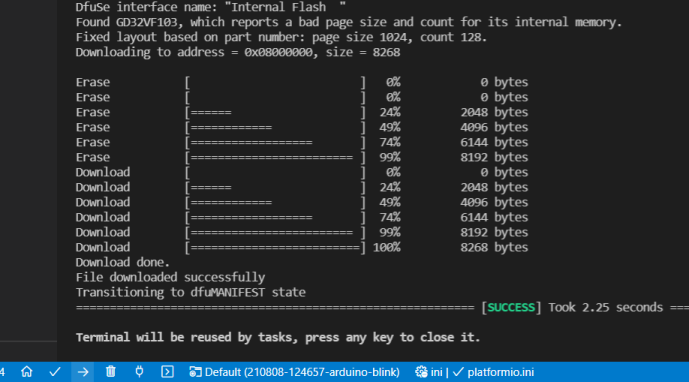  
Observe your Longan Nano how the LED blinks red.  
It's alive !  

## PIO + rust project

We will use a [cargo](https://doc.rust-lang.org/cargo/guide/index.html) plugin to create a new project that has all the files and folder structure to start a project with PIO and rust. This plugin is called [cargo-pio](https://github.com/ivmarkov/cargo-pio).  
Run in Debian:  
`$ cargo install cargo-pio`  
We will need also a target for the Risc-V processor (in Debian):  
`$ rustup target add riscv32imac-unknown-none-elf`  
PlatformIO needs Python 3. Debian comes preinstalled with it. Upgrade to the latest version in Debian packages (Debian is always a little behind):  

```bash
sudo apt update
sudo apt -y upgrade
python3 -V
```

The new project will be next to our other rust projects:  
`$ cd ~/rustprojects/`  
The magic incantation will create a scaffold for our first project `blinky_blue`:  
`$  cargo pio new -b sipeed-longan-nano -p gd32v blinky_blue`  
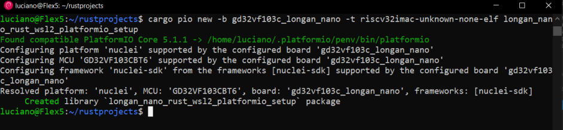  

Open VSCode in Windows, change it to WSL-Debian mode (left bottom green box), click on New WSL Window, click Open Folder and find  
`~/rustprojects/blinky_blue/`  
or equivalent, but with your username  
`/home/luciano/rustprojects/blinky_blue/`  
and click OK.  

We need to change the `[env]` section of platform.ini:

```ini
[env]
extra_scripts = pre:platformio.git.py, pre:platformio.patch.py, platformio.cargo.py
board = sipeed-longan-nano
platform = gd32v
framework = gd32vf103-sdk
rust_lib = blinky_blue
rust_target = riscv32imac-unknown-none-elf
monitor_speed = 115200
upload_protocol = dfu
```

In Cargo.toml we will add some `[dependencies]`:  

```toml
[dependencies]
riscv-rt = "0.8.0"
longan-nano = "0.2.0"
```

and most important we have to change the edition in  `[lib]` section from 2015 to 2018 else you get the cryptic error  
`error[E0433]: failed to resolve: maybe a missing crate longan_nano?`:  

```toml
[lib]
...
edition = "2018"
...
```

In .gitignore we add the `target/` folder next to the `.pio`:  

```ini
.pio/
target/
```

Finally we come to coding in rust.  
In `src/lib.rs` we remove the `ESP-IDF` and `Arduino` sections. The remaining `All others` section should look like this:  

```rust
////////////////////////////////////////////////////////
// All others                                         //
////////////////////////////////////////////////////////

use longan_nano::hal::{pac, prelude::*};
use longan_nano::led::{Led, rgb};

#[no_mangle]
extern "C" fn main() -> i32 {
    let dp = pac::Peripherals::take().unwrap();
    let mut rcu = dp.RCU.configure().sysclk(108.mhz()).freeze();

    let gpioa = dp.GPIOA.split(&mut rcu);
    let gpioc = dp.GPIOC.split(&mut rcu);

     let (mut red, mut green, mut blue) = rgb(gpioc.pc13, gpioa.pa1, gpioa.pa2);
     let leds: [&mut dyn Led; 3] = [&mut red, &mut green, &mut blue];

    leds[0].off();
    leds[1].off();
    leds[2].off();

    let mut i = 0;
    let mut on_off = false;
    loop {
        if i > 5_000_000 {
            i = 0;
            if on_off==false{
                leds[2].off();
                on_off=true;                
            }else{
                leds[2].on();
                on_off=false;
            }
        } else{
            i += 1;
        }
    }
    0
}
```

Good.  
Now we can click on `PlatformIO: Build` button in the status bar.  
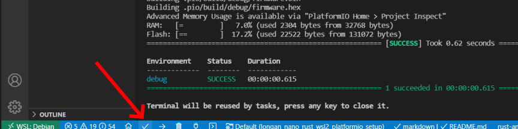  
And we have a successful build.  

Put the Longan Nano in `DFU mode` (BOOT0 and RESET mini-buttons) and click on `PlatformIO: Upload` button on the statusbar.  
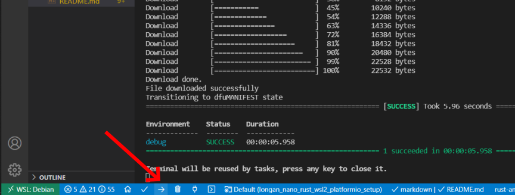  
It works! The Nano has a blinking blue LED !  
Congratulations !
You were very patient if you come to this line. The setup of the environment is not super smooth, but once you got it, it's done. You don't have to repeat it.  
And now I leave you to your fantasy, so you can code some great rust programs for Longan Nano.  

## git and GitHub

Just to finish in beauty: we will create a remote repository in Github and push our project.  
I tried the `GitHub CLI`, but it looks awful. I will not use it.  
I think VSCode already installs git, so you don't have to worry about it.  
You need to have already a [GitHub](https://github.com/) account and your SSH key for GitHub [prepared](https://docs.github.com/en/github/authenticating-to-github/connecting-to-github-with-ssh/generating-a-new-ssh-key-and-adding-it-to-the-ssh-agent) and [added](https://docs.github.com/en/github/authenticating-to-github/connecting-to-github-with-ssh/adding-a-new-ssh-key-to-your-github-account) to GitHub.  
In the VSCode terminal (Ctrl+j) I use ssh-agent to have the GitHub authorization in the background exclusively for this terminal session:  
`$ /usr/bin/ssh-agent`  
I add my github SSH key to the agent:  
`$ ssh-add ~/.ssh/lucianobestia_mac`  
I type my passphrase to authenticate that this is really me.  

Open in your browser <https://github.com>, login and there will be a big green `New` button. Click on it:  

- `Repository name:` blinky_blue
- `Description:` minimal rust program for Longan Nano
- click `Public` if needed
- uncheck (if needed): `Add README file`
- uncheck (if needed): `Add .gitignore`
- uncheck (if needed): `Choose a license`
- `Create repository`

The remote repository is created and instructions are shown:

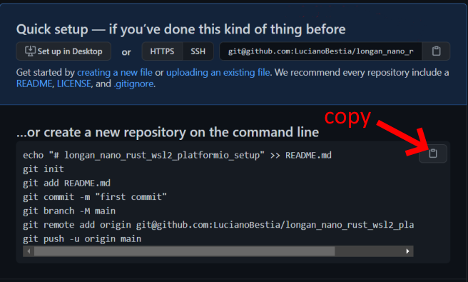  

Click on the button to copy the commands. Open the Debian bash terminal inside VSCode (Ctrl+j) and paste the commands.  
Now that the git and GitHub repositories are set, you can use VSCode icons (1) to commit (2+3) and push (4) to remote:  
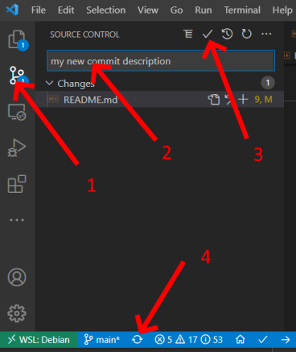  

You can find my repository here:
<https://github.com/LucianoBestia/blinky_blue>  
You can clone it locally like this:  

```bash
cd ~/rustprojects
git clone git@github.com:LucianoBestia/blinky_blue.git
```
